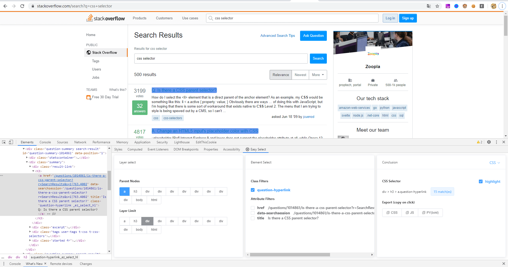

# EasySelect



A chrome extension, let you get **readable & maintainable** css selector from elements.

[中文文档](README_CN.md)

### Why not "Copy selector"?

Result of "Copy selector":

```
#TopstoryContent > div > div > div > div:nth-child(41) > div > div > h2 > div > a
```

Result of EasySelect:

```
div[itemprop='zhihu:question'] > a
```

## Install

[Chrome Web Store](https://chrome.google.com/webstore/detail/easy-select/emfpfmjldkffpibmfhdfmjdbkphccaom)

## Usage

Open **inspector** in the browser.

You can find **EasySelect** at right side of inspector ui.

Three part of EasySelect :

### 1. Layer limit panel

### 2. Element select panel

### 3. Conclusion panel

## Development
```
npm install
npm run serve
npm run build
npm run analyze
```

### Sponsor


