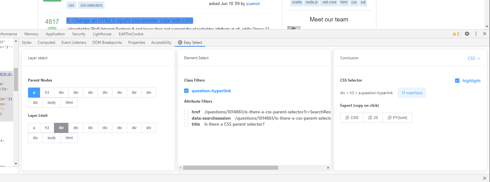

# Easy Select




一个Chrome扩展，让你根据页面元素快速获取**可读可维护**的 CSS 选择器。

### 为什么不用浏览器自带的 "Copy selector"?

举例来说，这是浏览器自动生成的：

```
#TopstoryContent > div > div > div > div:nth-child(41) > div > div > h2 > div > a
```

这是EasySelect拿到的：

```
div[itemprop='zhihu:question'] > a
```

## 安装

[Chrome扩展商店](https://chrome.google.com/webstore/detail/easy-select/emfpfmjldkffpibmfhdfmjdbkphccaom)

或从release手动安装

## 使用


首先，在浏览器中使用检查元素呼出调试工具，然后用inspector选择一个元素。

在右侧的面板选择一下“Easy Select”就能看到工具界面了。

界面分三个部分：

### 1. 层级选择面板

CSS选择器通常通过上级元素来进行辅助定位，例如：

```
div.items > article > a.title
```

最高是到html元素这一级，如果你不小心点多了，生成出的表达式会很长，可以使用第二排限制最终表达式的长度。


### 2. 元素选择面板

这个就是通过选择class还有元素属性构造选择器了。这个面板与层级选择面板是联动关系。

### 3. 结论面板

这里可以看到最终生成的表达式，当前页面的表达式匹配元素数量。

还可以进行高亮，以及最下面的表达式 / 语句复制。


## 开发
```
npm install # 安装环境
npm run serve # 编译并热更新
npm run build # 生产环境打包
npm run analyze # 分析包组件大小
```

## 下一版本计划

* ~~i18n 支持（中英）~~

* ~~为所有面板添加滚动条~~

* ~~优化从id生成的css选择器~~

* ~~高亮时带上背景色~~

* ~~css / xpath 切换选项卡~~

* 支持下标标号的生成，并提供开关

* 一键生成最优选择器

* 基于元素的选项记忆


### 响应号召，出摊摆碗


